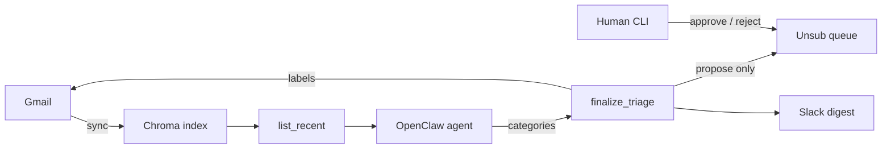

# Gmail Agent

**Safe, human-in-the-loop Gmail triage for [OpenClaw](https://docs.openclaw.ai).**

An agent lists unread mail, assigns one of six labels, posts a short Slack digest, and queues newsletter/spam unsubscribes for **your** approval. It never sends, deletes, archives, or unsubscribes on its own.

| | |
|---|---|
| **Package** | [`package/`](./package/) |
| **Install** | [`package/docs/INSTALL.md`](./package/docs/INSTALL.md) |
| **Commands** | [`package/docs/COMMANDS.md`](./package/docs/COMMANDS.md) |
| **Changelog** | [`CHANGELOG.md`](./CHANGELOG.md) |
| **Security** | [`SECURITY.md`](./SECURITY.md) |
| **License** | [MIT](./LICENSE) |

---

## How it works



1. **Sync** recent Gmail into Chroma (embeddings + metadata).
2. **List** unread mail that is not already labeled and not yet seen (pages of ≤25).
3. **Categorize** into six buckets; call **one** `finalize_triage` per page.
4. **Finalize** applies `{prefix}/<CAT>` labels (default `OC/`), **replacing** any other `{prefix}/*` category on that message, marks NEWSLETTER/SOCIAL/SPAM read, queues NEWSLETTER/SPAM for approval.
5. **Slack** shows counts for all categories; bullets only for ACTION/URGENT and NEWSLETTER.
6. **Verify** recovers if the model drops the meta-tool `tool_call` `id`.
7. **Post-unsub watch** — after you approve an unsub, later mail from that sender (past a grace window) is forced to **SPAM** and not re-queued.

---

## Categories

| Category | Mark read | Unsub queue | Slack bullets |
|---|---|---|---|
| URGENT | — | — | yes |
| ACTION-REQUIRED | — | — | yes |
| FYI | — | — | — |
| SOCIAL | yes | — | — |
| NEWSLETTER | yes | propose | yes |
| SPAM | yes | propose | — |

Categories are exclusive: reclassify replaces the previous `OC/*` label (does not stack). After a successful unsub approve, the sender is watched — see [Post-unsub watch](#post-unsub-watch).

---

## Post-unsub watch

Newsletters sometimes keep arriving after a “successful” List-Unsubscribe. This package treats that as recidivism:

1. `--approve` records the From address in `unsubscribe_watch.json` (email scope by default).
2. A grace window (default 3 days) ignores confirmation / “sorry to see you go” mail.
3. After grace, `finalize_triage` overrides the category to **SPAM**, marks read, skips unsub propose.
4. After enough distinct From addresses on the same domain, the watch may promote to **domain** scope.

```bash
python3 "$OPENCLAW_HOME/bin/list_unsubscribe_mcp.py" --watch
python3 "$OPENCLAW_HOME/bin/list_unsubscribe_mcp.py" --unwatch news@brand.example
# ops / e2e seed:
python3 "$OPENCLAW_HOME/bin/list_unsubscribe_mcp.py" --watch-add 'News <news@brand.example>' --days-ago 5
```

Offline test (no Gmail): `python3 package/scripts/test_post_unsub_watch.py`

Full operator command list (imperative phrases + invocations): [`package/docs/COMMANDS.md`](./package/docs/COMMANDS.md).

---

## Safety

- No send / delete / trash / archive in triage flows
- Unsubscribe is **propose → human approve** (CLI; digests list pending ids + senders); do not allowlist `approve_unsubscribe` on the triage agent
- Finalize is the only batch mutator during triage
- One-click unsub: HTTPS only, no redirects, private hosts blocked
- Small models: page size ≤25 + compact finalize + post-batch verify
- Post-unsub SPAM override is automatic in finalize; clearing a watch is a human CLI/MCP action

See [`CHANGELOG.md`](./CHANGELOG.md) for release notes.

---

## Repository layout

```text
├── README.md
├── LICENSE / CHANGELOG.md / SECURITY.md / CONTRIBUTING.md
├── docs/HISTORY.md          # design notes (no host secrets)
└── package/
    ├── mcp/                 # Python MCP + ops (stdlib)
    ├── scripts/             # cron runners
    ├── openclaw/            # agent rules + SKILL.md
    ├── docs/INSTALL.md
    ├── docs/COMMANDS.md     # imperative command phrases + CLI
    └── .env.example
```

---

## Commands

See **[`package/docs/COMMANDS.md`](./package/docs/COMMANDS.md)** for every runnable command as an imperative phrase with `[placeholders]` (e.g. *List pending to unsubscribe*, *Unsuppress this sender/domain `[…]`*).

---

## Quick start

**Prerequisites:** OpenClaw, Gmail OAuth MCP, Chroma + embedder + retrieve API, Slack bot token, an LLM with reliable tool calling.

```bash
export OPENCLAW_HOME="${OPENCLAW_HOME:-$HOME/.openclaw}"
mkdir -p "$OPENCLAW_HOME/bin" "$OPENCLAW_HOME/gmail" "$OPENCLAW_HOME/logs" "$OPENCLAW_HOME/run"

cp package/mcp/*.py "$OPENCLAW_HOME/bin/"
cp package/scripts/*.sh "$OPENCLAW_HOME/bin/"
# optional: e2e harnesses
cp package/scripts/test_post_unsub_watch.py package/scripts/e2e_post_unsub_live.py "$OPENCLAW_HOME/bin/" 2>/dev/null || true
chmod +x "$OPENCLAW_HOME/bin/"*.sh

cp package/.env.example "$OPENCLAW_HOME/gmail.env"
# edit every placeholder (URLs, Slack channel, agent id)
set -a; source "$OPENCLAW_HOME/gmail.env"; set +a
```

Then follow **[`package/docs/INSTALL.md`](./package/docs/INSTALL.md)** (MCP registration, allowlist, agent rules, cron, smoke).

```bash
GMAIL_TRIAGE_TOTAL=25 "$OPENCLAW_HOME/bin/gmail_triage_2h.sh"

python3 "$OPENCLAW_HOME/bin/list_unsubscribe_mcp.py" --pending
python3 "$OPENCLAW_HOME/bin/list_unsubscribe_mcp.py" --approve <pending_id>
python3 "$OPENCLAW_HOME/bin/list_unsubscribe_mcp.py" --watch
```

---

## Cron (typical)

| Job | Schedule | Role |
|---|---|---|
| Triage | 7am · 5pm · 10pm · 2am ET | Light sync + triage pages |
| Nightly | early morning | Sync + prune |
| OAuth refresh | early morning | Token refresh |

Example: [`package/openclaw/cron.example.json`](./package/openclaw/cron.example.json).

---

## Configuration

| Variable | Required | Purpose |
|---|---|---|
| `CHROMA_URL` | yes | Chroma HTTP base |
| `GMAIL_EMBED_URL` | yes | Embeddings endpoint |
| `GMAIL_RETRIEVE_URL` | yes | Retrieve API |
| `GMAIL_SLACK_CHANNEL` | yes (triage) | Digest channel |
| `GMAIL_AGENT_ID` | | Default `gmail-triage` |
| `GMAIL_CHROMA_COLLECTION` | | Default `gmail_inbox` |
| `GMAIL_LABEL_PREFIX` | | Default `OC` |
| `OPENCLAW_HOME` | | Default `~/.openclaw` |
| `GMAIL_POST_UNSUB_GRACE_DAYS` | | Default `3` — wait before watch→SPAM |
| `GMAIL_POST_UNSUB_WATCH` | | Default on — set `0` to disable |

Full template: [`package/.env.example`](./package/.env.example). Never commit credentials or a filled-in env file.
