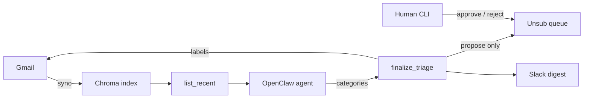

# Gmail Agent

**Safe, human-in-the-loop Gmail triage for [OpenClaw](https://docs.openclaw.ai).**

An agent lists unread mail, assigns one of six labels, posts a short Slack digest, and queues newsletter/spam unsubscribes for **your** approval. It never sends, deletes, archives, or unsubscribes on its own.

| | |
|---|---|
| **Package** | [`package/`](./package/) |
| **Install** | [`package/docs/INSTALL.md`](./package/docs/INSTALL.md) |
| **Changelog** | [`CHANGELOG.md`](./CHANGELOG.md) |
| **Security** | [`SECURITY.md`](./SECURITY.md) |
| **License** | [MIT](./LICENSE) |

---

## How it works



1. **Sync** recent Gmail into Chroma (embeddings + metadata).
2. **List** unread mail that is not already labeled and not yet seen (pages of ≤25).
3. **Categorize** into six buckets; call **one** `finalize_triage` per page.
4. **Finalize** applies `{prefix}/<CAT>` labels (default `OC/`), marks NEWSLETTER/SOCIAL read, queues NEWSLETTER/SPAM for approval.
5. **Slack** shows counts for all categories; bullets only for ACTION/URGENT and NEWSLETTER.
6. **Verify** recovers if the model drops the meta-tool `tool_call` `id`.

---

## Categories

| Category | Mark read | Unsub queue | Slack bullets |
|---|---|---|---|
| URGENT | — | — | yes |
| ACTION-REQUIRED | — | — | yes |
| FYI | — | — | — |
| SOCIAL | yes | — | — |
| NEWSLETTER | yes | propose | yes |
| SPAM | — | propose | — |

---

## Safety

- No send / delete / trash / archive in triage flows
- Unsubscribe is **propose → human approve** (CLI); do not allowlist `approve_unsubscribe` on the triage agent
- Finalize is the only batch mutator during triage
- One-click unsub: HTTPS only, no redirects, private hosts blocked
- Small models: page size ≤25 + compact finalize + post-batch verify

See [`CHANGELOG.md`](./CHANGELOG.md) for correctness and security fixes applied before this release.

---

## Repository layout

```text
├── README.md
├── LICENSE / CHANGELOG.md / SECURITY.md / CONTRIBUTING.md
├── docs/HISTORY.md          # design notes (no host secrets)
└── package/
    ├── mcp/                 # Python MCP + ops (stdlib)
    ├── scripts/             # cron runners
    ├── openclaw/            # agent rules + SKILL.md
    ├── docs/INSTALL.md
    └── .env.example
```

---

## Quick start

**Prerequisites:** OpenClaw, Gmail OAuth MCP, Chroma + embedder + retrieve API, Slack bot token, an LLM with reliable tool calling.

```bash
export OPENCLAW_HOME="${OPENCLAW_HOME:-$HOME/.openclaw}"
mkdir -p "$OPENCLAW_HOME/bin" "$OPENCLAW_HOME/gmail" "$OPENCLAW_HOME/logs" "$OPENCLAW_HOME/run"

cp package/mcp/*.py "$OPENCLAW_HOME/bin/"
cp package/scripts/*.sh "$OPENCLAW_HOME/bin/"
chmod +x "$OPENCLAW_HOME/bin/"*.sh

cp package/.env.example "$OPENCLAW_HOME/gmail.env"
# edit every placeholder (URLs, Slack channel, agent id)
set -a; source "$OPENCLAW_HOME/gmail.env"; set +a
```

Then follow **[`package/docs/INSTALL.md`](./package/docs/INSTALL.md)** (MCP registration, allowlist, agent rules, cron, smoke).

```bash
GMAIL_TRIAGE_TOTAL=25 "$OPENCLAW_HOME/bin/gmail_triage_2h.sh"

python3 "$OPENCLAW_HOME/bin/list_unsubscribe_mcp.py" --pending
python3 "$OPENCLAW_HOME/bin/list_unsubscribe_mcp.py" --approve <pending_id>
```

---

## Cron (typical)

| Job | Schedule | Role |
|---|---|---|
| Triage | every 2h | Light sync + triage pages |
| Nightly | early morning | Sync + prune |
| OAuth refresh | early morning | Token refresh |

Example: [`package/openclaw/cron.example.json`](./package/openclaw/cron.example.json).

---

## Configuration

| Variable | Required | Purpose |
|---|---|---|
| `CHROMA_URL` | yes | Chroma HTTP base |
| `GMAIL_EMBED_URL` | yes | Embeddings endpoint |
| `GMAIL_RETRIEVE_URL` | yes | Retrieve API |
| `GMAIL_SLACK_CHANNEL` | yes (triage) | Digest channel |
| `GMAIL_AGENT_ID` | | Default `gmail-triage` |
| `GMAIL_CHROMA_COLLECTION` | | Default `gmail_inbox` |
| `GMAIL_LABEL_PREFIX` | | Default `OC` |
| `OPENCLAW_HOME` | | Default `~/.openclaw` |

Full template: [`package/.env.example`](./package/.env.example). Never commit credentials or a filled-in env file.
